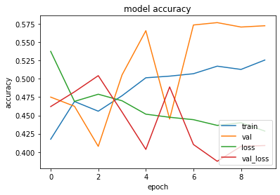
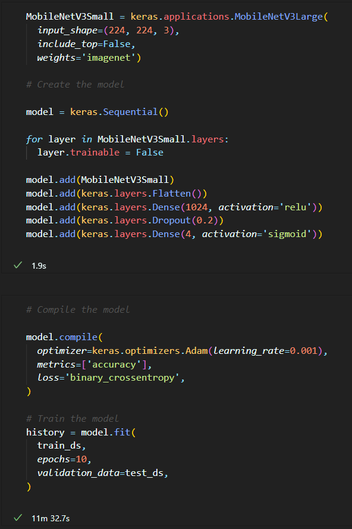
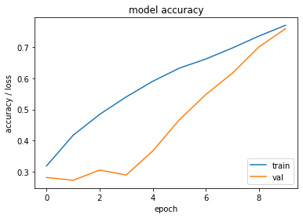
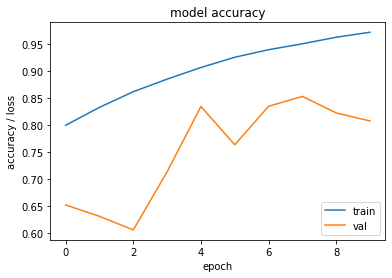
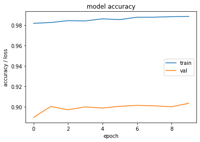
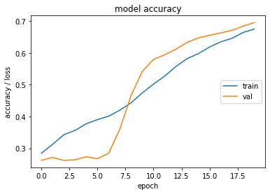

# This is my project diary

## 19/10/2022

Today I have been deciding the specific classes of images I want to use for my project.
I had initially intended on using only 1 class, however I have decided to use 2 classes instead as I think it will be more interesting to see the results of the pruning on 2 classes rather than 1,
It will also demonstrate better the different strengths and weaknesses of the individual pruning methods.

I have decided to use the following sets of images:

- [Flowers Dataset](https://storage.googleapis.com/download.tensorflow.org/example_images/flower_photos.tgz)
	This dataset is likely to be an easier dataset for the models to get high accuracy on, as the different flowers are quite distinct from each other.

- [Alzheimer's Dataset](https://www.kaggle.com/datasets/uraninjo/augmented-alzheimer-mri-dataset)
	This dataset is going to be more difficult for the models as the changes are more subtle between the different scan images, and the images are not as distinct from each other.

I am going to follow the tutorial [here](https://www.tensorflow.org/tutorials/images/classification) which should help me to get a good understanding of how to use the datasets and how to train the models to start with.
I have no prior experience training models so this will be a good starting point for me.
I will then need to use parts of the code from the tutorial to transfer run the transfer learning.

## 26/10/2022

Today I have been working on the transfer learning tutorial, I've made more progress through it and I've managed to get
Mobilenetv3 to run on the flowers dataset, however I'm having some issues with the alzheimer's dataset.
This is significant progress as this was a major blocker for me as I was not sure how to go forward with the prediction.

## 01/11/2022

Today I've worked more on the transfer learning tutorial and it can now identify the different flowers in the flowers dataset, 
with varying degrees of accuracy, around 80% was the best I got however this was only after 5 epochs and was the first time I have tried transfer learning.

## 09/11/2022

I had lost some of my git history for my diary, so I have had to rewrite some of the diary entries.
I have found more flower dataset images here and I've decided to change over to this as soon as possible;
https://www.kaggle.com/competitions/tpu-getting-started/overview

## 14/11/2022

I am training the model "Mobilenetv3 Small" with the alzheimer's dataset, I have been able to get it to run and it is currently training.
The power required to train the models is making it difficult to use trial and error for the parameters, so I am going to try and find a way to use the GPU on my laptop to train the models as soon as possible.
I'm also going to optimise the way I am training the models as to not use more power than necessary. This means I've got to get a better understanding of the models I am training with and how they work.
I have found this paper [here](https://arxiv.org/abs/1905.02244) which I think will be useful for me to read through and understand the structure of Mobilenetv3.

## 15/11/2022

I've had trouble getting the Alzheimers classification to work with transfer learning, so I decided to try and run other people's code to see if I could get it to work.
I have found that my transfer learning could be significantly more efficient and accurate if I use the existing code, so I'll have to try and identify where I went wrong with my code and make improvements.

## 21/11/2022

Today I managed to get the accuracy up to 90% on the alzheimer's dataset, this is a significant improvement from the 60% I was getting before. My model appears to still be overfitting however this progress is good. This was done through transfer learning on the Mobilenetv3 small model.

Output from the model during fine-tuning:
loss: 0.0314 - accuracy: 0.9883 - val_loss: 0.1337 - val_accuracy: 0.9036

## 22/11/2022

Here's some graphs of the model's predictions on the alzheimer's dataset:#
This graph was made using the MobilenetV3Small model and transfer learning on the alzheimer's dataset, with all but 3 layers of the mobilenetv3 model frozen.

Here's the code that was used to generate that graph

Here's some positive progress from unfreezing all the layers of the model and "fine-tuning" the model:

Here is a graph of where I was fine tuning the model however I had overfitted the model and it was not generalising well to the test data:

Here is my first attempt at training the mobilenetV3Large model after unfreezing all the layers:

I have also setup my laptop properly using Manjaro Linux to train the models on the GPU, this should make it much easier to train the models and to try different parameters and should allow me to create a confusion matrix for different parameters.

## 23/11/2022

I have achived 99% accuracy on my model identifying Alzheimer's (validation dataset). This was unfortunatley not saved however as it crashed, however I believe I can get it to that level again.
I have written a scritpt to use different base models for transfer learning and to output the results of training to a JSON file so I can analyse the results later, it also saves the model to a file so I can use it later.
This should make it a lot easier to use different models, datasets and parameters to train the models and to analyse the results and make the confusion matrix.

## 27/11/2022
I have been working lots on the interim report and getting it ready to submit, during this time I have also been setting my laptop off to train the models
as I work. I discovered that my '99%' accuracy was from the model learning the validation set through the augmented images, so I have had to retrain all the 
models with images I have augmented myself.

Soon I'll finish the Alzheimers dataset training and I'll start working on the flowers dataset.

## 28/11/2022

Today I have had trouble with the training, my GPU kept running out of memory due to me not releasing the ram after the keras model was trained. This meant I had to keep on checking and restarting the training, every few models. This is now fixed and I have been able to train the models without any issues. They are currently training and there is a lot of progress to be made.

## 29/11/2022

Today I have decided to start work on the training and testing library which I can use to speed up training and increase reliability of my training, through unit tests and consistency.
This library will allow me to adjust parameters for fitting and compilation to let me easily do hyperparameter tuning.

## 1/12/2022

I have been working lots on my report and the training library, this has taken a while to get all the information I feel I need in my report, however I have now mostly finished it and will submit it soon.

I have made lots of graphs from the history of the models in training, this made it a lot easier to talk about the different strengths and weaknesses of the different base models.

## 24/1/2023

I've manually reviewed my dataset I'm using and I've found it to have multiple repeated images. Due to the poor quality of the dataset I'm using I've decided to use a different dataset for my project, which I believe is the original data from the corrupted dataset I was using.
https://www.oasis-brains.org/

This dataset has more information about the patients, such as their sex, age and different scores on tests relating to the disease.

This also allows me to predict whether or not a person has Alzheimer's from all the MRI scans they have taken, rather than just one.

I hope to get this dataset working soon and to start training the models, and I'm aiming for at least a 90% accuracy on the validation dataset.

## 15/02/2023

I've downloaded the OASIS dataset 1 and I've created some graphs to analyse the data and to try and identify potential biases in the data. The main problem with it is that there are few MRI scans of people with Alzheimer's, and they're mostly old, which means if the model is given the age of the patient, it will cause bias with it, as it's more likely to be an older person with Alzheimer's in this dataset. I need to identify what different parameters given alongside the MRI scans in the dataset will cause bias with the model (primarily by giving the model the age of the patient).

## 28/02/2023

I have decided to create a web-UI for my project, this will allow me to easily show the results of the models and to allow people to upload their own images to test the models on. This should be easy to do with Flask and I hope to have it done soon.

I've also started downloading the new OASIS dataset again after I ran out of space on my hard drive.